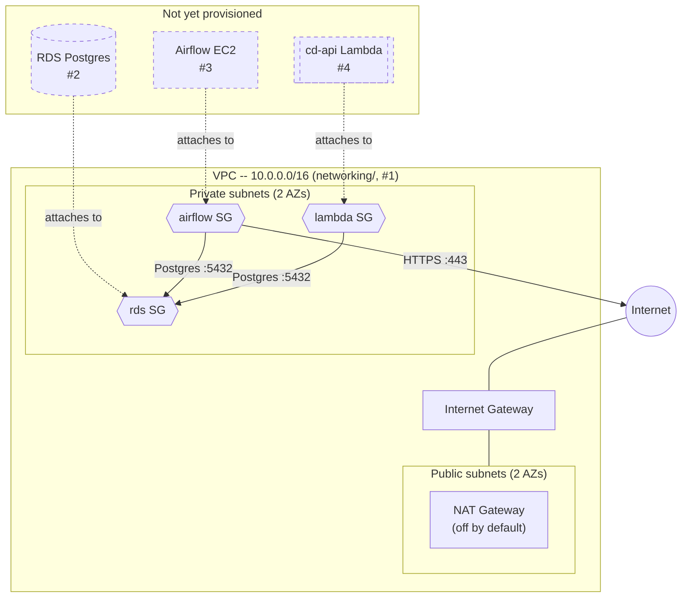

# CD-Infrastructure

Infrastructure as code for provisioning AWS resources for `cd-platform`. See
`terraform/README.md` for setup and usage of each `terraform/*` directory.

## Architecture

Dashed nodes (RDS, Airflow EC2, cd-api's Lambda) aren't provisioned yet --
only their security groups exist so far, reserved by `networking/` for
whichever of #2/#3/#4 lands first. `bootstrap/`'s S3 state bucket and KMS
key aren't part of this diagram -- they hold Terraform's own state and sit
outside the VPC entirely, unrelated to the app's runtime traffic.
