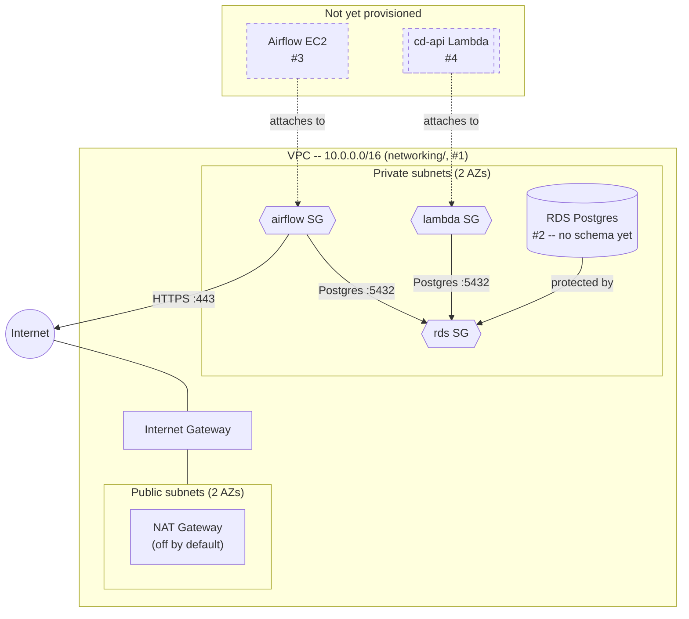

# CD-Infrastructure

Infrastructure as code for provisioning AWS resources for `cd-platform`. See
`terraform/README.md` for setup and usage of each `terraform/*` directory.

## Architecture

RDS (#2) is provisioned -- encrypted under its own customer-managed KMS
key, single-AZ, reachable only from the `airflow`/`lambda` security groups
-- but has no schema yet: that's blocked on #3's Airflow EC2 instance
existing (the only durable path to actually reach it) to run the initial
Alembic migration. Dashed nodes (Airflow EC2, cd-api's Lambda) aren't
provisioned at all yet -- only their security groups exist so far.
`bootstrap/`'s S3 state bucket/KMS key and `rds/`'s own KMS key aren't part
of this diagram -- they're supporting resources, not part of the app's
runtime traffic path.
