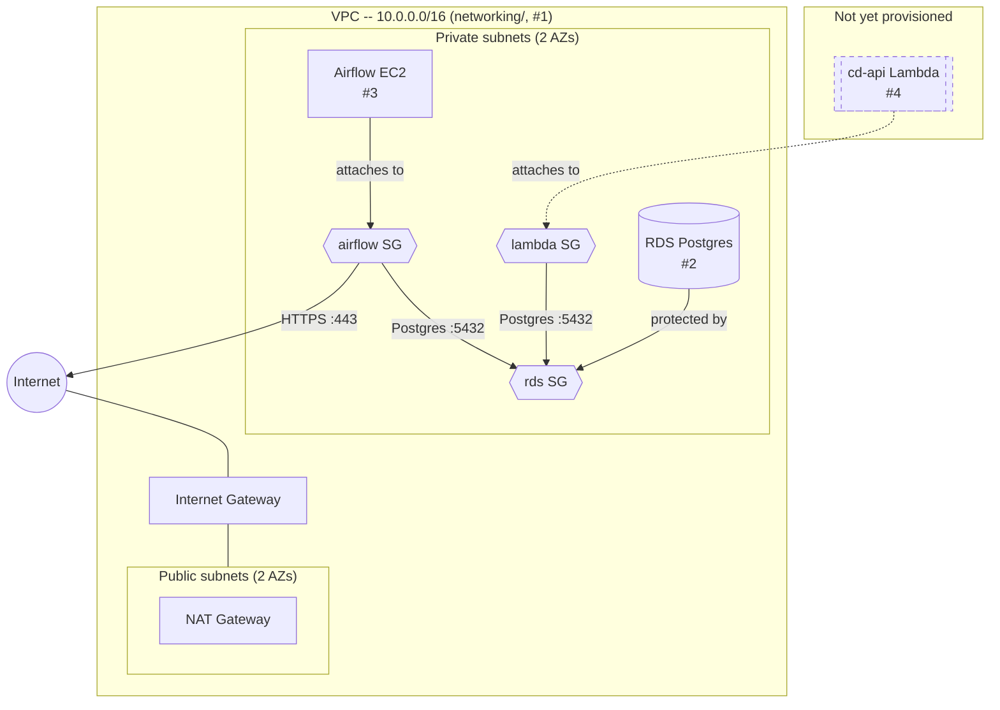

# CD-Infrastructure

Infrastructure as code for provisioning AWS resources for `cd-platform`. See
`terraform/README.md` for setup and usage of each `terraform/*` directory.

## Architecture

RDS (#2) and the Airflow EC2 instance (#3) are both provisioned. RDS is
encrypted under its own customer-managed KMS key, single-AZ, reachable
only from the `airflow`/`lambda` security groups; its schema (and Airflow's
own metadata database) come from `cd-etl`'s container migrating itself on
every start, run from the Airflow instance -- the only durable path to
reach RDS. The Airflow instance itself has no public ingress at all --
runs `cd-etl` + a `watchtower` sidecar polling GHCR for new releases, and
is reachable only via SSM Session Manager (shell or port-forwarding to its
UI), never a public IP. The dashed node (cd-api's Lambda) isn't provisioned
yet -- only its security group exists so far. `bootstrap/`'s S3 state
bucket/KMS key and `rds/`'s/`airflow/`'s own KMS keys aren't part of this
diagram -- they're supporting resources, not part of the app's runtime
traffic path.
