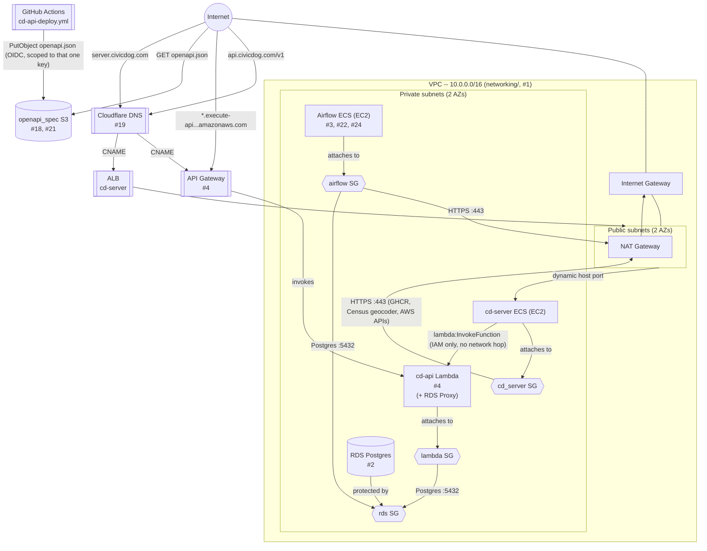

# CD-Infrastructure

Infrastructure as code for provisioning AWS resources for `cd-platform`. See
`terraform/README.md` for setup and usage of each `terraform/*` directory.

## Architecture

RDS (#2), self-hosted Airflow (#3, now `airflow_ecs` -- decomposed onto 4
ECS services per `#22`/`#24`), cd-api's Lambda + API Gateway (#4), and
cd-server's ECS (EC2) service + ALB are all provisioned -- nothing left
planned/dashed. `airflow_ecs` originally ran **alongside** a single plain
EC2 instance (`terraform/airflow/`) while the ECS decomposition was being
validated, sharing that instance's `airflow` security group, KMS key, and
Secrets Manager secrets rather than provisioning duplicates; once
validated, that original instance was decommissioned (`#42`) and this
module absorbed direct ownership of the shared KMS key/secrets (moved via
`terraform state mv`, not recreated). RDS is encrypted under its own
customer-managed KMS key, single-AZ, reachable only from the
`airflow`/`lambda` security groups; its schema comes from `cd-etl`'s
container migrating itself on every start, run from the Airflow ECS
instance -- the only durable path to reach RDS. The sibling
`airflow_metadata` database and a scoped least-privilege database role
are both bootstrapped automatically on that instance's first boot (RDS
has no equivalent to a Postgres init script), using the RDS master
credentials only transiently -- `cd-etl` connects as the scoped role,
never the master user. Documented in `terraform/README.md`. The instance
itself has no public ingress at all -- runs `cd-etl`'s 4 ECS services and
is reachable only via SSM Session Manager (shell or port-forwarding to
the Airflow UI), never a public IP.

cd-api's Lambda sits behind API Gateway (a static API key gates access for
now, a deliberate MVP stopgap) and reaches RDS through RDS Proxy -- omitted
as its own node above since it reuses the `lambda` security group entirely
(the `lambda_sg -- Postgres :5432 --> rds_sg` edge already covers it at the
network level), with its own scoped least-privilege database role
bootstrapped manually (not automatically, unlike `airflow_ecs`'s -- Lambda
has no boot-time hook to run it from), documented in `terraform/README.md`.
`bootstrap/`'s S3 state bucket/KMS key/GitHub OIDC provider and every
component's own KMS key aren't part of this diagram -- they're supporting
resources, not part of the app's runtime traffic path.

`server.civicdog.com` is a Cloudflare-managed CNAME onto a public ALB
(`cd-server/`), which forwards to `cd-server`'s ECS service -- **EC2**
launch type, not Fargate (cheaper for an always-on workload, same stance
`cd-infra#24` takes for Airflow's own ECS decomposition), a separate
cluster/instance from `airflow_ecs` above. Unlike every other
custom domain in this repo, its ACM certificate is regional (`us-west-2`,
matching the ALB's own region) rather than requiring `us-east-1` --
API Gateway's/Amplify's/Cognito's CloudFront-backed custom domains are
the ones with that constraint, not an ALB. `cd-server` reaches `cd-api`
by invoking its Lambda **directly via `boto3`** (an IAM
`lambda:InvokeFunction` grant, shown above), not over HTTP or API
Gateway -- no network path between the two is needed, so `cd_server_sg`
has no ingress from `lambda_sg` at all.

`api.civicdog.com` (#19) is a Cloudflare-managed CNAME onto API Gateway's
custom domain (an ACM cert + `EDGE`/CloudFront endpoint), with `/v1`
URL-path versioning via `base_path_mapping` -- a friendlier alternate entry
point onto the exact same `apigw`/stage/Lambda as the raw
`*.execute-api...amazonaws.com` invoke URL, both shown above since either
still works. The `openapi_spec` S3 bucket (#18, its CORS config added in
#21) is unrelated to that request path entirely -- a separate,
publicly-readable bucket (SSE-S3, deliberately not a customer-managed KMS
key, since anonymous public `GetObject` is the whole point) serving
`openapi.json` for `cd-website`'s docs viewer at `docs.civicdog.com`. The
only writer is `cd-api-deploy.yml`'s GitHub Actions run (shown above) via
its GitHub OIDC role, on every `cd-api-vX.X.X` tag deploy -- scoped to
`s3:PutObject` on that one key, nothing broader. Terraform only
provisions the bucket and that write grant; it never uploads to the
bucket itself.
