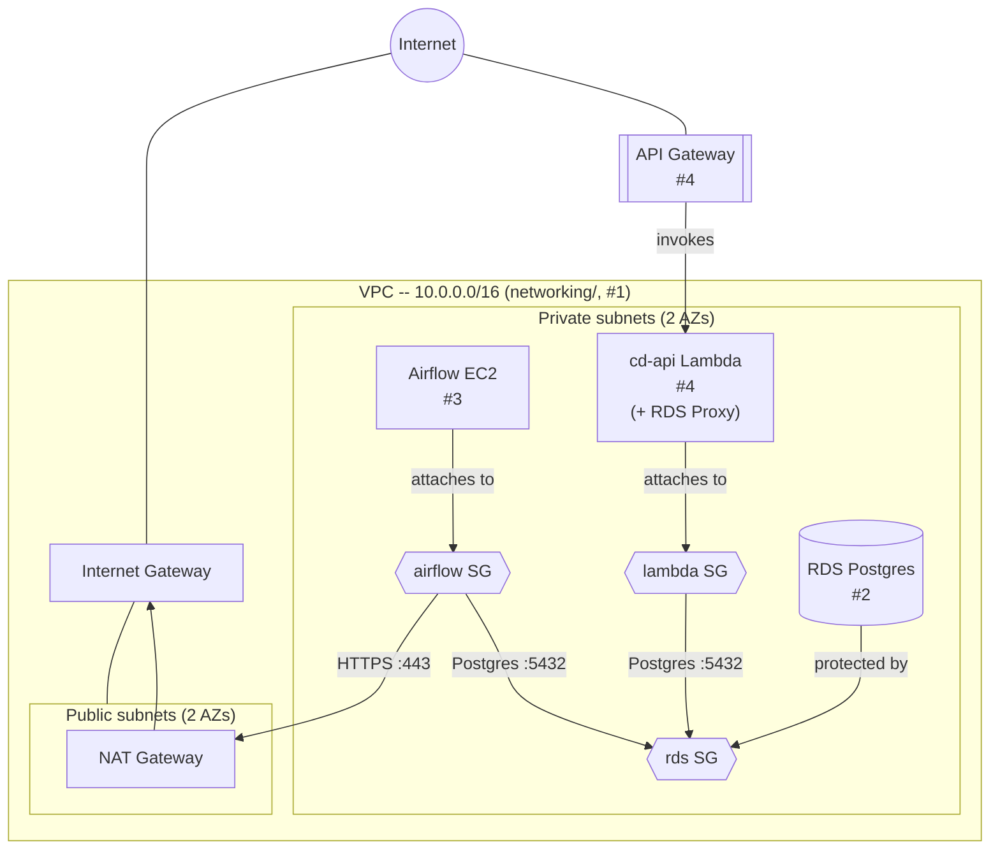

# CD-Infrastructure

Infrastructure as code for provisioning AWS resources for `cd-platform`. See
`terraform/README.md` for setup and usage of each `terraform/*` directory.

## Architecture

RDS (#2), the Airflow EC2 instance (#3), and cd-api's Lambda + API Gateway
(#4) are all provisioned -- nothing left planned/dashed. RDS is encrypted
under its own customer-managed KMS key, single-AZ, reachable only from the
`airflow`/`lambda` security groups; its schema comes from `cd-etl`'s
container migrating itself on every start, run from the Airflow instance
-- the only durable path to reach RDS. The sibling `airflow_metadata`
database and a scoped least-privilege database role are both bootstrapped
automatically on the Airflow instance's first boot (RDS has no equivalent
to a Postgres init script), using the RDS master credentials only
transiently -- `cd-etl` connects as the scoped role, never the master
user. Documented in `terraform/README.md`. The Airflow instance itself has
no public ingress at all -- runs `cd-etl` + a `watchtower` sidecar polling
GHCR for new releases, and is reachable only via SSM Session Manager
(shell or port-forwarding to its UI), never a public IP.

cd-api's Lambda sits behind API Gateway (a static API key gates access for
now, a deliberate MVP stopgap) and reaches RDS through RDS Proxy -- omitted
as its own node above since it reuses the `lambda` security group entirely
(the `lambda_sg -- Postgres :5432 --> rds_sg` edge already covers it at the
network level), with its own scoped least-privilege database role
bootstrapped manually (not automatically, unlike `airflow/`'s -- Lambda has
no boot-time hook to run it from), documented in `terraform/README.md`.
`bootstrap/`'s S3 state bucket/KMS key/GitHub OIDC provider and every
component's own KMS key aren't part of this diagram -- they're supporting
resources, not part of the app's runtime traffic path.
